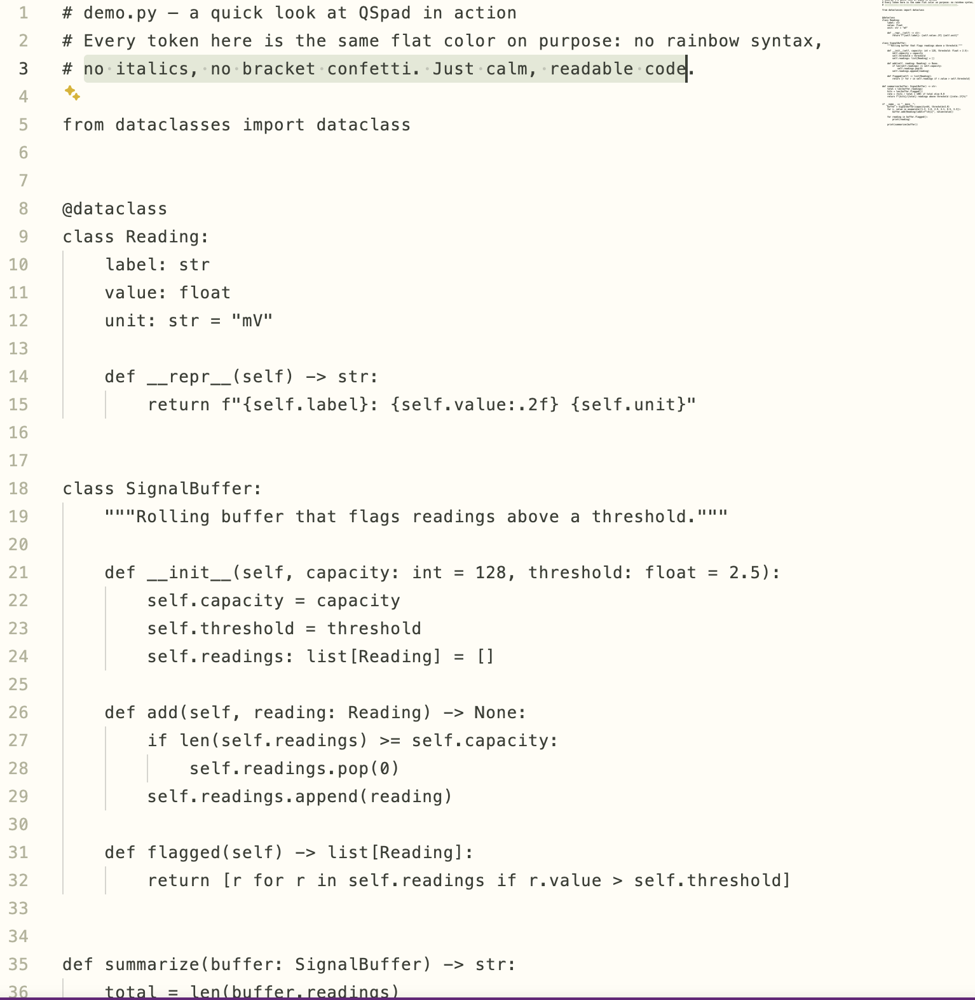

# QSpad — Neurodivergent Friendly Theme

A minimalist, low-contrast VS Code theme built around the reading comfort tweaks that actually helped: a warm ivory background instead of stark white, one flat text color instead of a rainbow of syntax colors, muted sage-green UI chrome, wide letter spacing, generous line height, no italics, no bracket-pair rainbow colors, and semantic highlighting turned off. The same choices that ease dyslexia (low visual clutter, no color-based cognitive load, no flashing bracket colors) tend to help ADHD, autistic, and other sensory-sensitive readers too.

Minimalism is the point, not a side effect — every choice here favors sensory comfort and a feeling of safety over visual interest. Comments, keywords, strings, and variables are all the same color on purpose. If you want *some* color distinction back, see "Tuning it further" below.



## What it changes

Installing this extension sets (as defaults you can still override):

- **Theme**: `QSpad (Neurodivergent Friendly)` — `#FFFDF5` background, `#3B3F36` text, muted sage UI chrome, Pantone Withered Rose (`#A26666`) for deleted/conflict git markers, and a deliberately darker forest green (`#1F5C33`) for added/inserted markers
- **Font**: Menlo (Consolas on Windows, DejaVu Sans Mono on Linux), no ligatures
- **Size/spacing**: 13px, 22px line height, +0.5 letter spacing
- **No bracket rainbow colors** (`editor.bracketPairColorization.enabled: false`)
- **No semantic highlighting** (`editor.semanticHighlighting.enabled: false`) — this is what stops language extensions (e.g. R, Python) from re-coloring functions/keywords on top of the theme

## Install

**From the Marketplace** (once published): search "QSpad" in the Extensions panel, or
```
ext install qingshanneuro.qspad
```

**From source**:
```
git clone https://github.com/QingshanNeuro/qspad.git
cd qspad
npx @vscode/vsce package
code --install-extension qspad-0.1.2.vsix
```

## Tuning it further

- **Want some syntax color back?** Edit `themes/qspad-color-theme.json` and split the one big `tokenColors` rule into a few groups (e.g. keep comments/strings distinct, leave functions/variables flat) — this is exactly what we did interactively before flattening it all the way.
- **Different font?** Override `editor.fontFamily` in your own `settings.json` — extension defaults never lock you out of changing them.
- **Different accent?** The sage-green UI accents live in `themes/qspad-color-theme.json` under `colors` (`focusBorder`, `editor.selectionBackground`, `editorBracketMatch.border`).

## Colorblind accessibility

The "added" git indicator (gutter bars, Source Control decorations, inserted-line highlighting) uses a deliberately darker forest green (`#1F5C33`) rather than a pale sage, so it holds real luminance separation from the Withered Rose used for "deleted" under color-blindness simulation (1.94:1 contrast under deuteranopia, 1.51:1 under protanopia). If you rely on git status colors specifically, VS Code's letter badges (`A`/`M`/`D`/`U` in the Source Control and Explorer views) are a more reliable, color-independent signal.

## Author

Qingshan

## License

MIT
